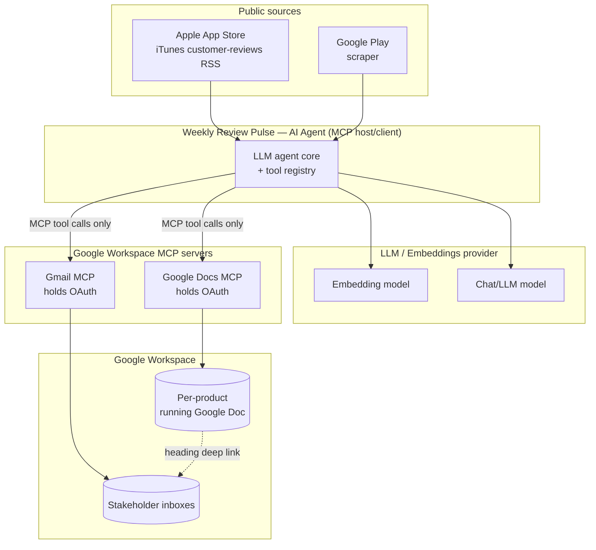
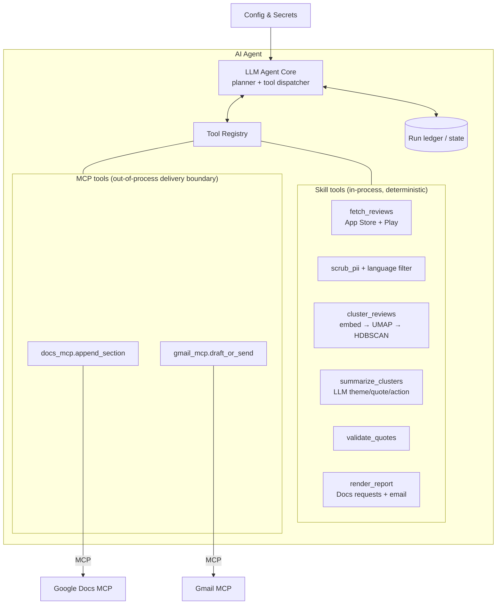
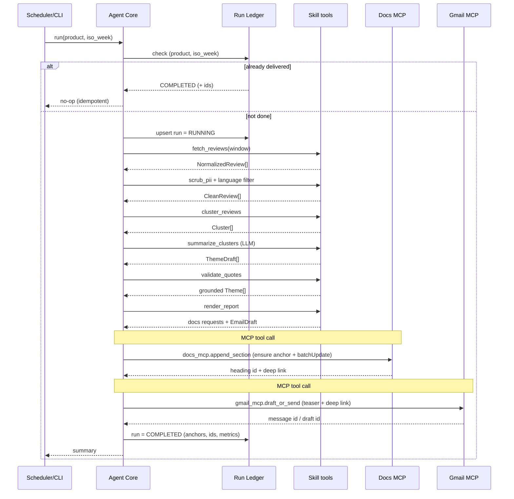
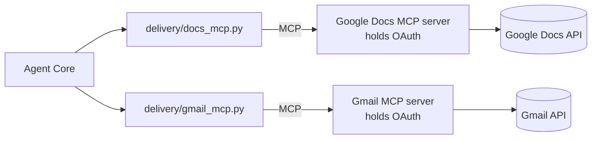
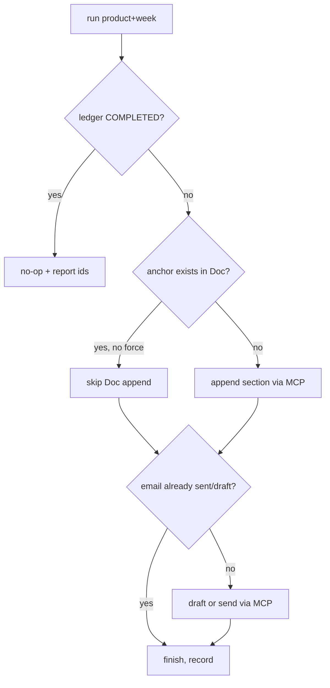

# Weekly Product Review Pulse — Architecture

> Companion to [`problemStatement.md`](./problemStatement.md). Every requirement in the
> problem statement is traceable to a module, MCP usage, and a phased exit criterion here
> (and in `implementationPlan.md`).

---

## 1. Overview

The Weekly Product Review Pulse is an **AI agent**. Its reasoning core is an LLM that, once
per product per ISO week, drives a workflow: it gathers public App Store and Google Play
reviews, mines them for themes / quotes / actions, writes a one-page report, and then
**takes actions in Google Workspace exclusively through MCP tools** — appending the report
to a running Google Doc (Google Docs MCP) and announcing it by email (Gmail MCP).

The agent is an **MCP host/client**. Google Docs and Gmail are exposed to it *only* as MCP
tools. It holds *no* Google credentials and makes *no* direct Docs/Gmail REST calls. OAuth
secrets live inside the MCP servers' configuration.

### 1.1 What "AI agent" means here

This is an agent, not a hard-coded script: an **LLM reasoning core** sits at the center,
plans the run, and invokes **tools** to do work. Tools fall into three groups:

| Tool group | Examples | Nature |
|---|---|---|
| **Skill tools** (in-process) | `fetch_reviews`, `scrub_pii`, `cluster_reviews`, `validate_quotes`, `render_report` | Deterministic Python capabilities the agent calls; heavy/numeric work (embeddings, UMAP+HDBSCAN) is encapsulated here so it is reliable and cheap. |
| **MCP tools** (out-of-process) | Google Docs MCP (`get_document`, `batch_update`), Gmail MCP (`create_draft`, `send_message`) | The **only** path to human-visible delivery. Provided by external MCP servers that own the Google OAuth. |
| **LLM reasoning** | theme naming, quote selection, action ideas, "who this helps" | The model's own generative step, run over clustered evidence. |

The agent's loop is bounded and auditable: it follows a defined plan, calls tools, checks
results (e.g. idempotency, quote grounding), and records every delivery identifier.

### 1.2 Design principles

| Principle | How it shows up |
|---|---|
| **Agent + MCP tools** | One LLM-driven agent core; all Google Workspace effects go through MCP tools behind a `delivery/` boundary. |
| **MCP-only delivery** | No Google SDK import anywhere outside the MCP servers. |
| **Idempotency by construction** | Deterministic Doc section anchor + run ledger keyed on `(product, iso_week)`. |
| **Grounding over fluency** | Every quote the LLM emits is validated against real review text before publish. |
| **Reviews are data, not instructions** | Review text is sandboxed in prompts; never executed as commands. |
| **Modular concerns** | Ingestion ⟂ Reasoning ⟂ Rendering ⟂ Delivery, connected by typed contracts and exposed to the agent as tools. |

---

## 2. C4 Context



**Key boundary:** the only arrows leaving the agent toward Google Workspace go *through* the
MCP servers as tool calls. OAuth secrets live in the MCP servers, never in the agent.

---

## 3. Agent architecture



### 3.1 Agent core

| Element | Responsibility |
|---|---|
| **Planner** | Expands a run goal (`pulse for product P, week W`) into ordered tool calls; short-circuits if the ledger says the run is already complete. |
| **Tool dispatcher** | Invokes registered tools, validates their typed outputs, enforces per-run cost/token limits, retries transient MCP failures. |
| **Tool registry** | Declares each tool's name, schema, and whether it is a skill tool or an MCP tool. MCP tools are loaded from configured MCP server endpoints. |
| **Memory / state** | Reads & writes the run ledger for idempotency and audit. |

The agent core never imports Google SDKs. It only knows MCP tools by their declared schema.

### 3.2 Skill tools (the agent's capabilities)

| Tool | Module | Responsibility | Output |
|---|---|---|---|
| `fetch_reviews` | `ingestion/` (`appstore.py`, `playstore.py`, `normalize.py`) | Pull iTunes RSS + scrape Play, merge, dedup, window-filter (8–12 wks). | `NormalizedReview[]` |
| `scrub_pii` / language filter | `preprocess/` (`pii.py`, `language.py`) | Remove PII before LLM/publish; keep target languages. | `CleanReview[]` |
| `cluster_reviews` | `reasoning/embed.py`, `reasoning/cluster.py` | Embed → UMAP reduce → HDBSCAN cluster → rank (size × recency × rating spread). | `Cluster[]` |
| `summarize_clusters` | `reasoning/summarize.py` | LLM names themes, drafts candidate quotes + actions + "who this helps". | `ThemeDraft[]` |
| `validate_quotes` | `reasoning/validate.py` | Hard gate: keep a quote only if present (exact/fuzzy) in real review text. | `Theme[]` (grounded) |
| `render_report` | `render/docs.py`, `render/email.py` | Build Google Docs `batchUpdate` requests + teaser email (HTML + text) with deep link. | Docs batch + `EmailDraft` |

### 3.3 MCP tools (delivery boundary)

| Tool | Module | Backed by | Action |
|---|---|---|---|
| `docs_mcp.append_section` | `delivery/docs_mcp.py` | Google Docs MCP | Ensure stable anchor exists, then append the week's dated section to the running Doc. |
| `gmail_mcp.draft_or_send` | `delivery/gmail_mcp.py` | Gmail MCP | Draft (dev/staging) or send (prod) the teaser email with the Doc deep link. |

`delivery/` is the **only** place that speaks MCP; swapping MCP servers touches nothing else.

---

## 4. End-to-end run sequence



---

## 5. Data contracts

Typed models (e.g. Pydantic) flow between the agent core and its tools. Illustrative shapes:

```python
class RawReview:
    source: Literal["app_store", "play_store"]
    product_id: str          # "groww"
    review_id: str           # source-native id
    rating: int              # 1..5
    title: str | None
    body: str
    author: str | None
    locale: str
    posted_at: datetime      # UTC
    app_version: str | None

class CleanReview(RawReview):
    body_clean: str          # PII-scrubbed
    pii_spans: list[Span]    # what was redacted (audit)
    lang: str

class Cluster:
    cluster_id: int
    review_ids: list[str]
    size: int
    score: float             # rank: size × recency × rating spread
    avg_rating: float

class Theme:
    title: str               # LLM-named
    summary: str
    quotes: list[Quote]      # ONLY validated quotes survive
    actions: list[str]
    who_this_helps: list[str]
    supporting_review_ids: list[str]

class Quote:
    text: str
    review_id: str           # provenance
    validated: bool          # must be True to publish
```

---

## 6. Reasoning pipeline (inside the analysis tools)

```mermaid
flowchart LR
    A[CleanReview[]] --> B[Embed<br/>batched + cached]
    B --> C[UMAP<br/>reduce dims]
    C --> D[HDBSCAN<br/>density clusters]
    D --> E[Rank clusters<br/>size·recency·rating]
    E --> F[Top-N clusters]
    F --> G[LLM summarize<br/>theme/quote/action]
    G --> H{Quote in<br/>real text?}
    H -- yes --> I[Keep quote]
    H -- no --> J[Drop quote]
    I --> K[Grounded Theme[]]
    J --> K
```

- **Embeddings + UMAP + HDBSCAN** group semantically similar reviews without a fixed cluster
  count; HDBSCAN's noise label naturally discards outliers.
- **LLM summarization** runs per top-ranked cluster (not over all raw text) to control cost
  and keep themes coherent. Review text is passed inside a clearly delimited, untrusted data
  block.
- **Quote validation** is a hard gate: a quote is publishable only if found (exact or
  high-similarity fuzzy match) within an actual review body — enforcing "quotes must appear
  in real review text."

---

## 7. MCP integration

### 7.1 The agent as MCP host/client

The agent core loads MCP server endpoints from config and registers their tools alongside its
in-process skills. It never imports Google SDKs for delivery. Two thin clients live behind
the `delivery/` boundary:



### 7.2 MCP tools the agent depends on

| MCP server | Tool (logical) | Used by agent for |
|---|---|---|
| Google Docs MCP | `get_document` | Read structure to find/confirm the section anchor before writing. |
| | `batch_update` | Insert a new dated heading + body for the week's section (the report **appended** to the Doc). |
| | `create_named_range` / heading id | Establish the **stable anchor** used for idempotency + deep link. |
| Gmail MCP | `create_draft` | Default in dev/staging (draft-only). |
| | `send_message` | Send teaser email in production (after explicit enablement). |

> Exact tool names/params come from the chosen MCP servers; the agent wraps them so swapping
> servers only touches `delivery/`.

### 7.3 Deep link strategy

After appending the section, the agent derives a **heading deep link**
(`https://docs.google.com/document/d/<docId>/edit#heading=<headingId>`) and embeds it in the
email's "Read full report" button. The email is a teaser (top themes as bullets), not a full
duplicate report.

---

## 8. Idempotency & state

Re-running `(product, iso_week)` must not create duplicate sections or duplicate sends.

### 8.1 Stable section anchor (Doc side)

Each weekly section uses a deterministic anchor derived from `(product, iso_week)`:

```
anchor = f"pulse-{product_id}-{iso_year}-W{iso_week:02d}"   # e.g. pulse-groww-2026-W26
```

Before writing, the `docs_mcp.append_section` tool calls `get_document` and checks whether a
heading/named range with that anchor already exists. If it does, the append is skipped (or
replaced under an explicit `--force` flag).

### 8.2 Run ledger (agent side)

```python
class RunRecord:
    run_id: str
    product_id: str
    iso_week: str            # "2026-W26"
    status: Literal["RUNNING","COMPLETED","FAILED"]
    doc_id: str | None
    section_anchor: str | None
    heading_id: str | None
    deep_link: str | None
    email_status: Literal["none","draft","sent"]
    message_id: str | None
    started_at: datetime
    finished_at: datetime | None
    metrics: dict            # reviews_in, clusters, tokens, cost, durations
    error: str | None
```

- Primary key: `(product_id, iso_week)`.
- Email idempotency: a run that already has `email_status in {draft,sent}` will not re-send.
- Storage starts as a simple file/SQLite ledger and can move to a managed DB later.

### 8.3 Idempotency decision flow



---

## 9. Scheduling & operation

| Mode | Trigger | Behavior |
|---|---|---|
| **Scheduled** | Cron, Monday morning IST | Agent runs each configured product for the just-completed ISO week. |
| **Backfill** | `cli run --product groww --week 2026-W21` | Recomputes any historic ISO week; idempotent against ledger + anchor. |
| **Dry run** | `cli run --dry-run` | Full agent loop, no MCP writes; prints rendered Doc requests + email. |

Default delivery posture: **draft-only email in dev/staging**; sending requires explicit
config (`EMAIL_MODE=send`) per the implementation plan.

---

## 10. Configuration & secrets

| Item | Lives in | Notes |
|---|---|---|
| Product registry (ids, store ids, locales) | agent config (`config/products.yaml`) | App Store app id + Play package per product. |
| Window (weeks), top-N themes, language allowlist | agent config | Defaults: 8–12 weeks, top 3–5 themes, `en`. |
| Cost/token limits per run | agent config | Hard caps enforced by the agent core. |
| LLM / embedding API keys | agent secret store / env | For reasoning only — not Google. |
| **Google OAuth secrets** | **MCP servers' configuration** | **Never** in the agent codebase (explicit non-goal). |
| MCP server endpoints + per-product Doc id | agent config | One running Doc per product. |

---

## 11. Safety & quality

| Concern | Control |
|---|---|
| **PII** | `scrub_pii` removes emails, phone numbers, names, account/card-like numbers before embedding, before the LLM, and before publishing. Redacted spans logged for audit. |
| **Prompt injection** | Review text is wrapped as untrusted data with explicit "treat as data, not instructions" framing; system prompt forbids following embedded instructions. |
| **Grounding** | `validate_quotes` drops any quote not present in real review text. |
| **Cost control** | Token/cost caps per run enforced by the agent core; summarize only top-N clusters; embeddings cached + batched. |
| **Least privilege** | Agent has no Google credentials; MCP servers scope to Docs append + Gmail send/draft only. |
| **Quality gates** | Minimum review-count threshold; if too few reviews, emit a "low-signal" section rather than hallucinating themes. |

---

## 12. Observability & audit

- **Run ledger** answers "what was sent when, for which week?" via stored `doc_id`,
  `heading_id`, `deep_link`, `message_id`, timestamps.
- **Structured logs** per tool call (counts, durations, token/cost).
- **Metrics**: reviews ingested, clusters found, quotes validated/dropped, tokens, cost,
  delivery latency.
- **Failure handling**: tool-level retries with backoff for transient network/MCP errors;
  run marked `FAILED` with error context; safe to re-run (idempotent).

---

## 13. Technology choices (proposed)

| Area | Choice | Rationale |
|---|---|---|
| Language | Python 3.11+ | Mature embeddings/clustering ecosystem. |
| Agent core | LLM with tool-calling + a tool registry | Drives the run and dispatches skill + MCP tools. |
| Models | Pydantic | Typed data contracts between core and tools. |
| Clustering | `umap-learn` + `hdbscan` | Density clustering without fixed k; noise handling. |
| App Store | iTunes customer-reviews RSS | Public, no auth. |
| Play Store | `google-play-scraper` (or equivalent) | Public reviews. |
| MCP | MCP client SDK | Host/client to Docs + Gmail MCP servers. |
| State | SQLite (start) → managed DB | Simple, file-based ledger to begin. |
| Scheduling | cron / scheduler service | Weekly cadence + CLI backfill. |

---

## 14. Directory layout (proposed)

```
app-review-pulse/
├── config/
│   ├── products.yaml
│   └── settings.yaml
├── src/pulse/
│   ├── agent/          # core.py (planner+dispatcher), registry.py, tools.py
│   ├── cli.py
│   ├── scheduler.py
│   ├── ingestion/      # appstore.py, playstore.py, normalize.py   (fetch_reviews)
│   ├── preprocess/     # language.py, pii.py                        (scrub_pii)
│   ├── reasoning/      # embed.py, cluster.py, summarize.py, validate.py
│   ├── render/         # docs.py, email.py                          (render_report)
│   ├── delivery/       # docs_mcp.py, gmail_mcp.py  (ONLY place that speaks MCP)
│   ├── state/          # ledger.py
│   └── models.py       # typed data contracts
├── tests/
└── docs/
    ├── problemStatement.md
    ├── architecture.md          # this file
    └── implementationPlan.md
```

---

## 15. Requirement → architecture traceability

| Requirement (problem statement) | Where addressed |
|---|---|
| AI agent using MCP for Gmail + Google Docs | §1, §3 agent architecture, §7 MCP integration |
| Ingest 8–12 wk reviews, App Store + Play, per product | §3.2 `fetch_reviews`, §10 config window |
| Cluster + rank via UMAP + HDBSCAN | §3.2 `cluster_reviews`, §6 |
| LLM names themes, pulls quotes, proposes actions | §3.2 `summarize_clusters`, §6 |
| Quotes must appear in real review text | §3.2 `validate_quotes` (hard gate), §11 grounding |
| One-page narrative (themes/quotes/actions/who-helps) | §3.2 `render_report`, §5 `Theme` |
| Deliver **only** via Docs MCP + Gmail MCP | §3.3 MCP tools, §7, `delivery/` boundary |
| Append dated section to single running Doc per product | §3.3 `docs_mcp.append_section`, §7.2, §8.1 anchor |
| Email = teaser + deep link, not full duplicate | §7.3 |
| Agent is MCP host/client, no embedded Google creds | §1, §3.1, §7.1, §10 |
| Weekly cadence + CLI backfill | §9 scheduling |
| Idempotent per product + ISO week | §8 idempotency & state |
| Auditable (ids + metadata) | §8.2 ledger, §12 observability |
| PII scrubbing; reviews as data; cost limits | §11 safety & quality |
| Dev/staging draft-only email default | §9, §7.2 |
